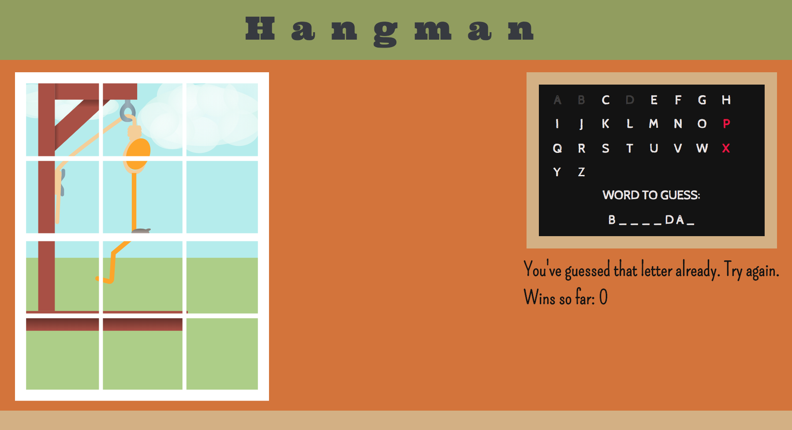

# Hangman Game (Vanilla JS)

## Version 2 and improvements:

The Plan
This version and those after are to bring in good habits: Gulp (, Git branch, testing, DRY out.
In addition, I want the player to choose the theme from a list as well as other ways to make the game more user friendly (keep track of wins, etc ...).
Although I wish to add improvements, I am keeping this in vanilla JavaScript because I want to. Sorry, jQuery. You'll get your turn later.

To do:

-[x] Make tests for new fcn to ignore - spaces and '

-[x] Add new fcn for new fcn to ignore - spaces and '

-[ ] Keep track of losses

-[x] Keep track of wins

-[ ] Offer buttons that load different themes

Someone suggested that I keep track of the guesses remaining, but there's a stick figure dying outside of the school in front of the students. His only role is to show you how many guesses are left. Do I need to add another field or is that just making code to prove something. Currently undecided.

## Toolbox

- HTML5/CSS3
- Vanilla JavaScript
- Sass
- Gulp
- Mocha
- Chai
- SVG illustrations by Sketch App

## Previous Versions:

**Version 1: Theme is Pants!**

The classic hangman game where the player chooses letters to guess a word. Good guesses leave the chalkboard and appear in the dashes below. Bad guesses are noted in red, and a body part appears outside on the gallows.
